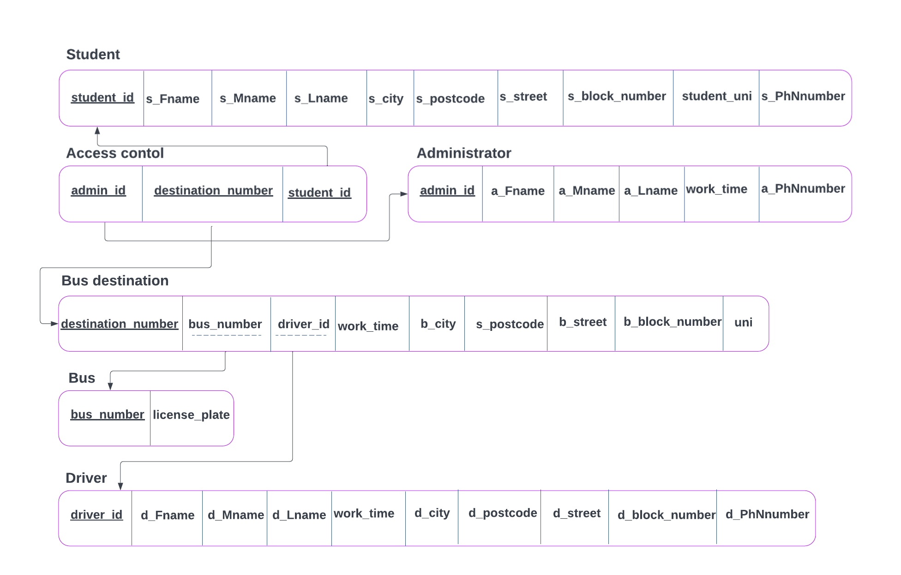

# 🚌 Bus Management Database System

A relational database management system (RDBMS) developed using SQL to manage a university bus transportation system.

The project models students, buses, drivers, destinations, administrators, and access control while enforcing data integrity using primary keys, foreign keys, and constraints.

---

#  Features

- Relational database design
- Entity-Relationship Diagram (ERD)
- Relational Schema
- SQL table creation scripts
- Primary and Foreign Key constraints
- Sample data insertion
- SQL queries for data retrieval
- Normalized database structure

---

#  Project Structure

```
Bus-System/
│
├── README.md
├── BusSystem.sql          # Complete SQL script
├── ERD.png
├── RelationalSchema.png
└── Documentation.pdf (optional)
```

---

#  Database Overview

The database manages information related to a university transportation system.

It stores:

- Students
- Drivers
- Buses
- Bus destinations
- Administrators
- Student access control

---

#  Database Tables

| Table | Description |
|--------|-------------|
| Student | Stores student information |
| Driver | Stores driver details |
| Bus | Stores bus information |
| Bus_Destination | Stores bus routes and destinations |
| Administrator | Stores administrator information |
| Access_Control | Links administrators, students, and bus destinations |

---

#  Entity Relationship Diagram (ERD)


---

#  Relational Schema



---

#  Relationships

- One **Bus** can serve multiple destinations.
- One **Driver** can be assigned to multiple destinations.
- One **Administrator** manages student transportation records.
- A **Student** is linked to a destination through the **Access_Control** table.
- **Access_Control** acts as a bridge table connecting:
  - Student
  - Administrator
  - Bus Destination

---

#  Database Constraints

The database includes:

- Primary Keys
- Foreign Keys
- Composite Primary Key (Access_Control)
- Identity column (Destination_Number)
- NOT NULL constraints
- Referential Integrity

---

#  How to Run

1. Open Oracle SQL Developer (or any Oracle SQL environment).
2. Create a new database connection.
3. Execute the SQL script:

```sql
@BusSystem.sql
```

or simply run the SQL file.

The script will:

- Create all tables
- Create constraints
- Insert sample records

---

#  Sample Data

The project includes sample data for:

- Students
- Drivers
- Buses
- Bus Destinations
- Administrators
- Access Control

This data is intended for testing and demonstration purposes.

---

#  Technologies

- Oracle SQL
- SQL Developer
- Relational Database Design

---

#  Learning Objectives

This project demonstrates:

- Database normalization
- ER modeling
- Relational schema design
- SQL DDL
- SQL DML
- Data integrity constraints
- Relationship modeling

---

# 👨‍💻 Authors

Developed as a Database Systems course project.
